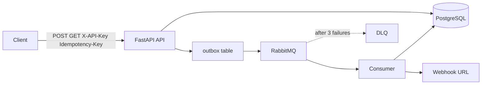
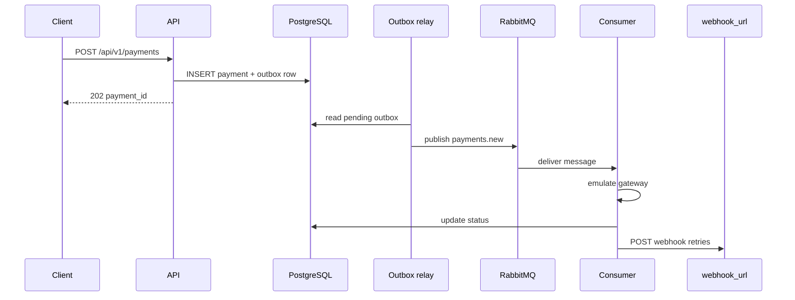
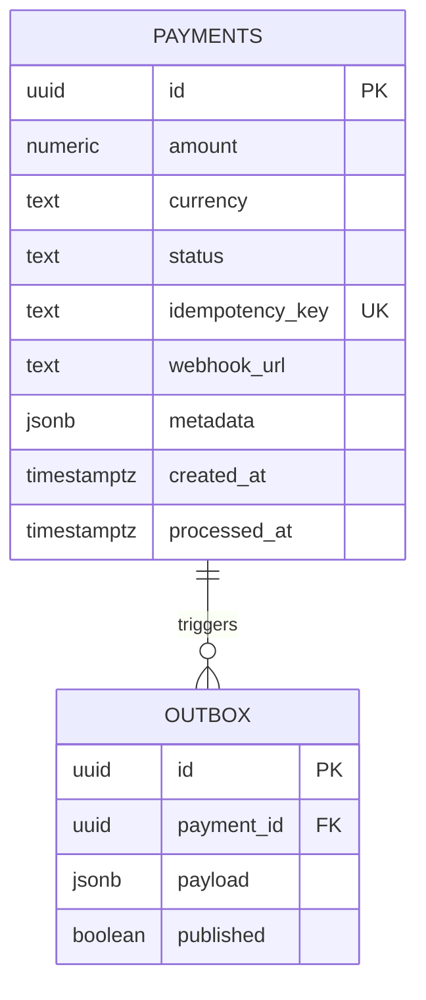
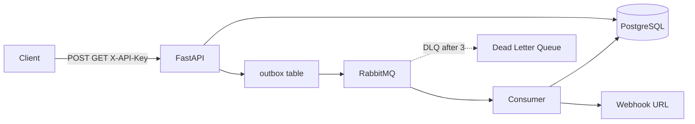

# Payment processing (async)

Сервис асинхронного процессинга платежей: **FastAPI**, **PostgreSQL**, **RabbitMQ** (FastStream), паттерн **Outbox**, **DLQ**, consumer с эмуляцией шлюза и **webhook** с retry.

## Запуск в Docker

В корне — **`docker-compose.dev.yml`** и **`docker-compose.test.yml`**, переменные из **`.env.dev` / `.env.test`**, шаблон — **`.env.example`**. Удобные цели — **`Makefile`** (`make dev-up`, `make test-up`, миграции).

1. Скопируйте шаблон окружения:

```bash
cp .env.example .env.dev
# для тестового стека: cp .env.example .env.test и выставьте DB_NAME=payments_test (и др.)
```

2. Dev (bind-mount `./backend`, API с `--reload`, миграции **не** вшиты в старт сервиса `app`):

```bash
make dev-up
make dev-migrate   # первый раз и после смены миграций
```

Сервисы: **`db`**, **`rabbitmq`**, **`app`** (FastAPI + outbox relay), **`consumer`**. API: [http://localhost:8000](http://localhost:8000), RabbitMQ UI: [http://localhost:15672](http://localhost:15672). Остановка: `make dev-down`.

3. Тестовый compose (отдельная БД `postgres_test_data`, при старте **`app`**: `alembic upgrade` + uvicorn):

```bash
make test-up
```

Остановка с удалением volume БД: `make test-down`.

Подключения собираются из **`DB_*`** / **`RABBITMQ_*`** через `field_validator` в `Settings`. В **`.env.dev`** / **`.env.test`** хосты уже заданы как `DB_HOST=db` и `RABBITMQ_HOST=rabbitmq` (Docker-сервисы). Compose передаёт переменные через `env_file` — без отдельных `environment` переопределений.

## Локальный запуск без Docker

1. Поднимите PostgreSQL и RabbitMQ (или `make dev-up` только с `db` и `rabbitmq` — при необходимости упростите compose локально).
2. Скопируйте `.env.example` в **`backend/.env`** и задайте **`DATABASE_URL`** и **`RABBITMQ_URL`** (для локального хоста — `localhost` в URL).
3. Из каталога `backend`:

```bash
pip install -e ".[dev]"
alembic upgrade head
uvicorn main:app --reload --app-dir src
```

Consumer в отдельном терминале:

```bash
payment-consumer
```

## Примеры запросов

По умолчанию API ожидает заголовок **`X-API-Key`** (в Docker: `dev-api-key`) и для создания платежа — **`Idempotency-Key`**.

Создать платёж (ответ **202 Accepted**):

```bash
curl -sS -X POST "http://localhost:8000/api/v1/payments" \
  -H "Content-Type: application/json" \
  -H "X-API-Key: dev-api-key" \
  -H "Idempotency-Key: $(uuidgen)" \
  -d '{
    "amount": "100.50",
    "currency": "USD",
    "description": "Test payment",
    "metadata": {"order_id": "ord-1"},
    "webhook_url": "https://example.com/webhook"
  }'
```

Получить платёж по `payment_id` из ответа выше:

```bash
curl -sS "http://localhost:8000/api/v1/payments/<payment_id>" \
  -H "X-API-Key: dev-api-key"
```

Документация OpenAPI: [http://localhost:8000/docs](http://localhost:8000/docs).

## Схемы

### Контекст (клиент → API → БД и брокер)



### Последовательность: создание платежа и обработка



### ER (упрощённо)



Краткий поток данных (блок-схема):



## Структура репозитория

- `backend/` — приложение: `src/core/` (в т.ч. **infrastructure/messaging**), `src/db/`, `alembic/`; модуль **`src/payments/`** в духе Clean Architecture: `domain/` (**entities**, **interfaces**, **dtos**, **exceptions**), `application/use_cases/`, `presentation/` (**api**, **dependencies**), `infrastructure/`, `outbox_relay/`
- `infra/` — заготовка под конфиги инфраструктуры
- `Makefile`, `docker-compose.dev.yml`, `docker-compose.test.yml`, `.env.example`
- `.env.example` — пример переменных для локальной разработки
